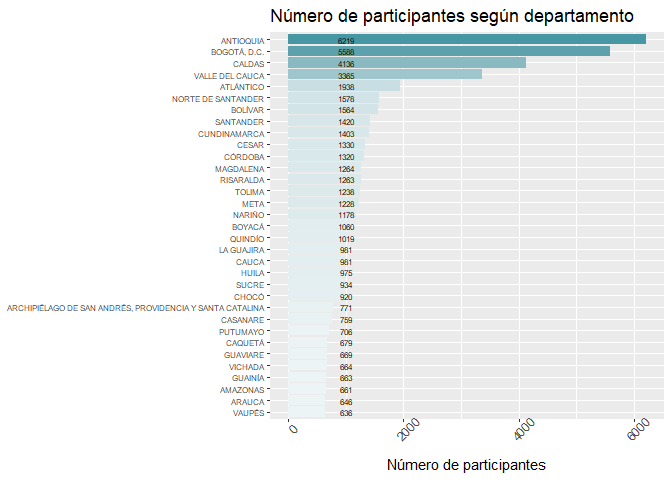

<script src="/pagedtable.js"></script>
<link href = "/pagedtable.css" rel="stylesheet" />


## ENCUESTA NACIONAL DE CONSUMO DE SPA EN COLOMBIA - PREPARANDO LOS DATAFRAMES

La Encuesta Nacional de Consumo de SPA, es un ejercicio de
caracterización epidemiológica que realiza el país periódicamente, de
acuerdo con el compromiso establecido en el *Asamblea General de las
Naciones Unidas* (2016).

En 2019 el DANE realizó esta encuesta en convenio con el Ministerio de
Justicia y del Derecho, como estrategia para hacer seguimiento, evaluar
y monitorear el problema del consumo de sustancias en diferentes
territorios del país.

El informe elaborado por el DANE es completo y se puede descargar, junto
con otros recursos, desde [este
enlace](https://www.dane.gov.co/index.php/estadisticas-por-tema/salud/encuesta-nacional-de-consumo-de-sustancias-psicoactivas-encspa "informe ENCSPA DANE").
Por otra parte, esa entidad pone a disposición del público los datos
anonimizados de toda la encuesta, con lo cual es posible acceder a las
respuestas de los encuestados y, con ello, profundizar en esta
problemática.

Si bien esta información es de libre acceso, no quiere decir que sea
fácil su preparación, especialmente para los profesionales no
familiarizados con el uso de bases de datos. Como paso previo para la
preparación de esta y futuras entradas, fue necesario desarrollar una
pequeña aplicación que tomara los microdatos publicados por el DANE y
los convirtiera en un archivo de base de datos SQLite3. El repositorio
de esa aplicación se encuentra en [este
enlace](https://github.com/carloshvelez/create-and-load-database-encspa "Repositorio aplicación crear y cargar base de datos").

Aún con lo anterior, es preciso programar las funciones que permitirán
preparar los dataframes que posteriormente se usarán para el análisis;
esto es lo que haremos en esta primera entrada de la serie, pese a que
implica un uso de nivel intermedio de R. En entradas posteriores
pasaremos a hacer análisis estadísticos.

Con esto iniciamos una serie de entradas en las que usaremos R para
preparar y analizar datos, públicamente disponibles, a fin de comprender
con mayor profundidad un problema de salud de relevancia para cualquier
profesional de este campo.

### Cargando los paquetes que usaremos

Para esta primera entrada usaremos los siguientes paquetes:

- **RSQLite:** Establece la conexión conexión la base de datos Sqlite3
  en la que están almacenados todos los datos de la encuesta.

- **dplyr:** permite el uso de “tuberías” (*pipelines*) para concatenar
  varias operaciones eficientemente.

- **jsonlite:** ayuda en la importación y manipulación de archivos en
  formato JSON.

- **readxl:** ofrece funcionalidades para la importanció de archivos en
  formato .xls y .xlsx.

- **ggplot:** Permite elaborar gráficos conmucha flexibilidad.

- **httr:** facilita las solicitudes http desde R.

Iniciaremos programando una función que usaremos a lo largo de la serie
para instalar paquetes, en caso de que aún no lo estén, y posteriormente
cargarlos.

``` r
cargar_paquetes <- function(paquetes){
  for (paquete in paquetes){
    if (!requireNamespace(paquete, quietly = TRUE)) {
      install.packages(paquete)
    }
    library(paquete, character.only = TRUE)
  }
}
```

Listo, ya podemos usar esa función para cargar nuestros paquetes:

``` r
cargar_paquetes(c("RSQLite", "jsonlite", "dplyr", "DT", "ggplot2", "readxl", "httr"))
```


### Conectando con la base de datos

Otra operación que estaremos usando constantemente es la de establecer
conexión con la base de datos. Para eso, usamos la función `dbConnect`
de `RSQLite`, para lo cual también construímos una ruta en la que está
alojada nuestra base de datos. En nuestro caso, el archivo de base de
datos está en la carpeta “database”, con nombre “encspa.db”.

``` r
establecer_conexion <- function(){
  ruta_bd <- file.path("database", "encspa.db")
  return(dbConnect(SQLite(), ruta_bd))
}
```

Con esa conexión ya podemos hacer consultas, que R transformará
automáticamente en dataframes. Recordaremos cerrar la conexión con la
base de datos cada vfez que hagamos una consulta, mediante
`dbDisconnect()`\`

Veamos un panorama general de la base de datos:

``` r
conexion <- establecer_conexion()
consulta <- "SELECT name, type FROM sqlite_master WHERE type IN ('table', 'view')"

panoramadb <- dbGetQuery(conexion, consulta)
dbDisconnect(conexion)
panoramadb
```

<div data-pagedtable="false">
  <script data-pagedtable-source type="application/json">
{"columns":[{"label":["name"],"name":[1],"type":["chr"],"align":["left"]},{"label":["type"],"name":[2],"type":["chr"],"align":["left"]}],"data":[{"1":"caracteristicas","2":"table"},{"1":"sqlite_sequence","2":"table"},{"1":"embarazo","2":"table"},{"1":"trabajo","2":"table"},{"1":"demanda_tratamiento","2":"table"},{"1":"personas_seleccionadas","2":"table"},{"1":"personas","2":"table"},{"1":"otras_sustancias","2":"table"},{"1":"heroína","2":"table"},{"1":"extasis","2":"table"},{"1":"basuco","2":"table"},{"1":"cocaina","2":"table"},{"1":"marihuana","2":"table"},{"1":"inhalables","2":"table"},{"1":"estimulantes","2":"table"},{"1":"tranquilizantes","2":"table"},{"1":"ilegales","2":"table"},{"1":"alcohol","2":"table"},{"1":"encuestas","2":"table"},{"1":"tabaco","2":"table"},{"1":"caracteristicas_adicionales","2":"table"}],"options":{"columns":{"min":{},"max":[10]},"rows":{"min":[10],"max":[10]},"pages":{}}}
  </script>
</div>

Tenemos 21 tablas, que incluyen datos sociodemográficos, consumo en el
trabajo, uso durante el embarazo, y sustancias legales e ilegales que se
evalúan en la encuesta. Por cierto.

Para comprender en su totalidad los datos de las tablas, debemos acudir
al [manual de la
encuesta](https://microdatos.dane.gov.co/index.php/catalog/680/pdf-documentation "manual encspa"),
pues tal como la descargamos, no dice mucho:

Por ejemplo, esta es una tabla con datos sociodemograficos de las
personas encuestadas:

``` r
conexion <- establecer_conexion()
df <- dbGetQuery(conexion, "SELECT * FROM caracteristicas")
dbDisconnect(conexion)
str(df, vec.len=2)
```

    'data.frame':   49756 obs. of  35 variables:
     $ D_01              : int  2 2 1 1 1 ...
     $ D_02              : int  4 4 1 4 1 ...
     $ D_03              : int  NA NA 8 NA 12 ...
     $ D_04              : int  NA NA 1 NA 3 ...
     $ D_05              : num  NA NA 48 NA 42 ...
     $ D_06              : int  1 1 1 1 1 ...
     $ D_07              : int  3 3 1 3 3 ...
     $ D_08              : int  4 2 4 3 3 ...
     $ D_09              : int  2 1 2 2 1 ...
     $ D_10              : int  2 1 2 2 2 ...
     $ D_11_A            : int  4 4 4 4 4 ...
     $ D_11_B            : int  4 4 4 4 3 ...
     $ D_11_C            : int  4 4 2 3 4 ...
     $ D_11_D            : int  4 4 2 3 4 ...
     $ D_11_E            : int  4 4 3 4 4 ...
     $ D_11_F            : int  4 4 4 4 4 ...
     $ D_11_G            : int  4 4 4 4 4 ...
     $ D_11_H            : int  4 4 4 4 4 ...
     $ D_11_I            : int  4 4 4 4 4 ...
     $ D_11_J            : int  4 4 4 4 4 ...
     $ D_11_K            : int  4 4 4 4 4 ...
     $ D_11_L            : int  4 4 4 4 4 ...
     $ D_11_M            : int  4 4 4 4 4 ...
     $ D_11_N            : int  4 4 4 4 4 ...
     $ D_12_A            : int  2 2 2 2 1 ...
     $ D_12_A_A          : int  NA NA NA NA 1 ...
     $ D_12_B            : int  2 2 2 1 1 ...
     $ D_12_B_A          : int  NA NA NA 2 1 ...
     $ D_12_C            : int  2 2 2 2 1 ...
     $ D_12_C_A          : int  NA NA NA NA 1 ...
     $ DIRECTORIO        : num  1 2 3 4 6 ...
     $ SECUENCIA_ENCUESTA: int  2 1 1 1 1 ...
     $ SECUENCIA_P       : int  1 1 1 1 1 ...
     $ ORDEN             : int  2 1 1 1 1 ...
     $ id                : int  1 2 3 4 5 ...

Obtenemos un dataframe con 34 variables y 49756 observaciones, pero los
nombres de las variables no son descriptivos y los valores están en
formato numérico, pese a que el manual de la encuesta señala que la
mayoría hacen referencia a variables cualitativas.

Debido a ese problema, más tarde tendremos que configurar los
dataframes. Por ahora, vamos a programar un modo de hacer consultas en
la base de datos.

### Generando consultas para la base de datos.

En la base de datos sólo vamos a mantener las tablas descargables desde
el sitio web del DANE. A lo largo de la serie tendremos que unir esos
datos con otras fuentes de información (por ejemplo nombre, ubicación o
población de cada departamento y municipio), pero esto no lo agregaremos
a la base de datos sinó que haremos las respectivas uniones a través de
la biblioteca `dplyr`. Con eso nos aseguraremos de hacer un código más
fácilmente comprensible y mantener tal como es, la información
proporcionada por el DANE.

Nuestro primer paso será construir listas anidadas en las que señalemos
las tablas y las variables que nos interesan. Por ejemplo:

``` r
datos_persona = list(
  tabla = "personas_seleccionadas", 
  variables= c("SEXO", "EDAD")
  )

datos_vivienda = list(
  tabla = "encuestas",
  variables = c("Depmuni", "TIPO", "SERVICIO", "ESTRATO", "TOTAL_PERSONAS")
)

datos_ocupacion = list(
  tabla = "caracteristicas", 
  variables= c("D_01", "D_02", "D_03", "D_04", "D_05","D_06", "D_07")
  )

datos_salud = list(
  tabla = "caracteristicas",
  variables = c("D_08", "D_09", "D_10")
)

otros_datos_demograficos = list(
  tabla = "caracteristicas_adicionales", 
  variables = c("D2_01", "D2_03", "D2_04", "D2_05", "D2_06", "D2_07")
  )
```

Luego, vamos a crear una función que construya una consulta sql,
utilizando los datos de esas listas anidadas. Parece un poco compleja,
pero en realidad no lo es; además, permite crear consultas de manera
dinámica y será útil para muchas necesidades futuras:

``` r
construir_consulta <- function(...){
  # Toma como entrada una o varias listas anidades con la información de tabla a consultar y variables dentro de cada tabla.
  campos <- list(...)
  #Generar lista de variables y tablas
  lista_variables = character()
  tablas = character()
  for (campo in campos){
    lista_variables = append(lista_variables, campo$variables)
    tablas = append(tablas, campo$tabla)
  }
  # definir las variables a consultar(comando SELECT)
  select_query <- lista_variables
  # definir las tablas desde las que se hará la consulta 
  from_query <- character()
  for (i in 1:length(tablas)-1){
    cadena <- sprintf("%s JOIN %s ON %s.DIRECTORIO = %s.DIRECTORIO",
                      #Variable inicial de la iteración sólo para la primera variable
                      ifelse(i == 1, tablas[i], ""),
                      tablas[i+1],
                      tablas[i],
                      tablas[i+1]
                      
    )
    from_query <- append(from_query, cadena)
  }
  #Devuelve cadena concatenado SELECT + VARIABLES + FROM + TABLAS 
  return (sprintf("SELECT %s FROM %s", 
                          paste(select_query, collapse = ", "), 
                          ifelse((length(campos) > 1), paste(from_query, collapse = ""), tablas))) # Condiciona para que use from_query sólo si hay varias tablas a consultar, de lo contrario, sólo la tabla
}
```

Ahora, basta con usar la función `construir_consulta()` para generar los
dataframes que necesitamos. Por ejemplo, consultemos datos de vivienda,
personales, ocupacionales y algunos otros sociodemográficos de quienes
respondieron la encuesta (recuerda las listas anidades que acabamos de
crear). Para lograrlo, establecemos conexión, construímos la consulta,
hacemos la consulta y cerramos la conexión:

``` r
conexion <- establecer_conexion()
q <- construir_consulta(datos_vivienda, datos_persona, datos_ocupacion, otros_datos_demograficos)
df_demograficos <- dbGetQuery(conexion, q)
dbDisconnect(conexion)
```

Lo anterior arroja el dataframe que necesitamos. Exploremos los primeros
20 registros:

``` r
head(df_demograficos, n=20)
```

<div data-pagedtable="false">
  <script data-pagedtable-source type="application/json">
{"columns":[{"label":[""],"name":["_rn_"],"type":[""],"align":["left"]},{"label":["Depmuni"],"name":[1],"type":["chr"],"align":["left"]},{"label":["TIPO"],"name":[2],"type":["int"],"align":["right"]},{"label":["SERVICIO"],"name":[3],"type":["int"],"align":["right"]},{"label":["ESTRATO"],"name":[4],"type":["int"],"align":["right"]},{"label":["TOTAL_PERSONAS"],"name":[5],"type":["int"],"align":["right"]},{"label":["SEXO"],"name":[6],"type":["int"],"align":["right"]},{"label":["EDAD"],"name":[7],"type":["dbl"],"align":["right"]},{"label":["D_01"],"name":[8],"type":["int"],"align":["right"]},{"label":["D_02"],"name":[9],"type":["int"],"align":["right"]},{"label":["D_03"],"name":[10],"type":["int"],"align":["right"]},{"label":["D_04"],"name":[11],"type":["int"],"align":["right"]},{"label":["D_05"],"name":[12],"type":["dbl"],"align":["right"]},{"label":["D_06"],"name":[13],"type":["int"],"align":["right"]},{"label":["D_07"],"name":[14],"type":["int"],"align":["right"]},{"label":["D2_01"],"name":[15],"type":["int"],"align":["right"]},{"label":["D2_03"],"name":[16],"type":["int"],"align":["right"]},{"label":["D2_04"],"name":[17],"type":["int"],"align":["right"]},{"label":["D2_05"],"name":[18],"type":["int"],"align":["right"]},{"label":["D2_06"],"name":[19],"type":["int"],"align":["right"]},{"label":["D2_07"],"name":[20],"type":["int"],"align":["right"]}],"data":[{"1":"15001","2":"1","3":"1","4":"3","5":"4","6":"2","7":"56","8":"2","9":"4","10":"NA","11":"NA","12":"NA","13":"1","14":"3","15":"9","16":"3","17":"2","18":"7","19":"1","20":"2","_rn_":"1"},{"1":"15001","2":"1","3":"1","4":"2","5":"3","6":"2","7":"62","8":"2","9":"4","10":"NA","11":"NA","12":"NA","13":"1","14":"3","15":"1","16":"4","17":"4","18":"1","19":"1","20":"2","_rn_":"2"},{"1":"15001","2":"2","3":"1","4":"3","5":"4","6":"1","7":"54","8":"1","9":"1","10":"8","11":"1","12":"48","13":"1","14":"1","15":"9","16":"2","17":"1","18":"5","19":"1","20":"1","_rn_":"3"},{"1":"15001","2":"1","3":"1","4":"2","5":"1","6":"2","7":"64","8":"1","9":"4","10":"NA","11":"NA","12":"NA","13":"1","14":"3","15":"9","16":"6","17":"0","18":"5","19":"1","20":"2","_rn_":"4"},{"1":"70215","2":"1","3":"1","4":"1","5":"3","6":"2","7":"46","8":"1","9":"1","10":"12","11":"3","12":"42","13":"1","14":"3","15":"9","16":"5","17":"2","18":"4","19":"1","20":"2","_rn_":"5"},{"1":"70215","2":"1","3":"1","4":"1","5":"5","6":"1","7":"33","8":"1","9":"1","10":"6","11":"1","12":"42","13":"1","14":"1","15":"5","16":"2","17":"1","18":"6","19":"1","20":"1","_rn_":"6"},{"1":"23001","2":"2","3":"1","4":"3","5":"4","6":"2","7":"33","8":"1","9":"1","10":"12","11":"4","12":"10","13":"1","14":"1","15":"9","16":"2","17":"2","18":"8","19":"1","20":"2","_rn_":"7"},{"1":"23001","2":"2","3":"1","4":"3","5":"1","6":"2","7":"27","8":"1","9":"1","10":"12","11":"1","12":"40","13":"1","14":"1","15":"9","16":"6","17":"0","18":"7","19":"1","20":"2","_rn_":"8"},{"1":"15001","2":"1","3":"1","4":"3","5":"4","6":"1","7":"31","8":"1","9":"1","10":"12","11":"1","12":"45","13":"1","14":"1","15":"9","16":"2","17":"0","18":"6","19":"1","20":"1","_rn_":"9"},{"1":"23001","2":"1","3":"1","4":"2","5":"6","6":"1","7":"28","8":"2","9":"8","10":"NA","11":"NA","12":"NA","13":"1","14":"3","15":"9","16":"6","17":"0","18":"4","19":"1","20":"1","_rn_":"10"},{"1":"23001","2":"2","3":"1","4":"2","5":"6","6":"2","7":"16","8":"2","9":"3","10":"NA","11":"NA","12":"NA","13":"1","14":"3","15":"9","16":"6","17":"0","18":"4","19":"NA","20":"NA","_rn_":"11"},{"1":"95001","2":"2","3":"1","4":"1","5":"3","6":"1","7":"31","8":"1","9":"1","10":"6","11":"1","12":"64","13":"1","14":"1","15":"9","16":"2","17":"2","18":"6","19":"1","20":"1","_rn_":"12"},{"1":"95001","2":"2","3":"1","4":"3","5":"3","6":"2","7":"41","8":"1","9":"1","10":"6","11":"4","12":"60","13":"1","14":"1","15":"1","16":"3","17":"1","18":"7","19":"1","20":"2","_rn_":"13"},{"1":"95001","2":"1","3":"1","4":"1","5":"4","6":"1","7":"39","8":"1","9":"1","10":"4","11":"4","12":"50","13":"1","14":"1","15":"9","16":"2","17":"2","18":"3","19":"1","20":"1","_rn_":"14"},{"1":"81001","2":"1","3":"1","4":"3","5":"2","6":"2","7":"64","8":"1","9":"4","10":"NA","11":"NA","12":"NA","13":"1","14":"3","15":"1","16":"2","17":"5","18":"3","19":"1","20":"2","_rn_":"15"},{"1":"95001","2":"2","3":"1","4":"1","5":"3","6":"1","7":"21","8":"2","9":"1","10":"10","11":"1","12":"16","13":"1","14":"1","15":"9","16":"6","17":"0","18":"5","19":"1","20":"1","_rn_":"16"},{"1":"95001","2":"1","3":"1","4":"1","5":"3","6":"2","7":"40","8":"1","9":"1","10":"12","11":"1","12":"56","13":"1","14":"3","15":"9","16":"5","17":"2","18":"5","19":"1","20":"2","_rn_":"17"},{"1":"23001","2":"2","3":"1","4":"2","5":"2","6":"2","7":"28","8":"1","9":"1","10":"12","11":"4","12":"25","13":"2","14":"NA","15":"9","16":"1","17":"0","18":"6","19":"1","20":"1","_rn_":"18"},{"1":"81001","2":"1","3":"1","4":"2","5":"6","6":"1","7":"24","8":"1","9":"1","10":"6","11":"1","12":"72","13":"1","14":"3","15":"9","16":"6","17":"0","18":"6","19":"1","20":"1","_rn_":"19"},{"1":"81001","2":"1","3":"1","4":"1","5":"4","6":"2","7":"18","8":"2","9":"4","10":"NA","11":"NA","12":"NA","13":"1","14":"1","15":"9","16":"6","17":"0","18":"5","19":"1","20":"2","_rn_":"20"}],"options":{"columns":{"min":{},"max":[10]},"rows":{"min":[10],"max":[10]},"pages":{}}}
  </script>
</div>

Como dijimos previamente, los nombres de las variables son poco
descriptivos, así que haremos bien si clarificamos el título de cada
variable y la etiqueta que representa cada número, cuando se trata de
variables cualitativas. Para eso, vamos a utilizar los diccionarios de
datos de la encuesta, lo cuales ya recopilamos previamente en un archivo
JSON gracias al aplicativo python cuyo repositorio referenciamos al
inicio de esta entrada.

### Generando dataframes más descriptivos

El JSON con los microdatos del DANE lo tenemos en la carpeta “json_data”
y está nombrado como “json_limpio.json”. Este archivo contiene la
información sobre los nombres y los pares clave - valor para las
variables cualitativas, que en R se pueden configurar como factores. Lo
configuramos todo en la siguiente función:

``` r
preparar_df<- function(dataframe){
  # Recibe como argumento un dataframe, y devuelve este mismo dataframe con nombres de columnas descriptivos y con pares clave valor configurados como factores. 
  # Cargar archivo:
  archivo <- "json_limpio.json"
  folder <- "json_data"
  datos_variables <- fromJSON(file.path(folder, archivo))
  # extraer etiquestas y niveles del archivo json
  for (nombre in colnames(dataframe)){
  etiquetas = datos_variables[[nombre]][["categorias"]]$labl
  niveles = as.integer(datos_variables[[nombre]][["categorias"]]$value)
  # Configurar cada columna del dataframe con los respectivos niveles y etiquetas
  if (length(datos_variables[[nombre]][["categorias"]]) > 0){
    dataframe[[nombre]] <- factor(dataframe[[nombre]], levels = niveles, labels=etiquetas)
  }
  #Asignar nuevos nombres a cada columan del dataframe
  names(dataframe)[names(dataframe) == nombre] = datos_variables[[nombre]]$etiqueta
  }
  # Devolver dataframe 
  return (dataframe)
}
```

Ahora sí, tenemos listo nuestro dataframe para hacer los análisis que
requerimos:

``` r
df_demograficos <- preparar_df(df_demograficos)
head(df_demograficos)
```

<div data-pagedtable="false">
  <script data-pagedtable-source type="application/json">
{"columns":[{"label":[""],"name":["_rn_"],"type":[""],"align":["left"]},{"label":["Fusión de código departamento y código municipio"],"name":[1],"type":["chr"],"align":["left"]},{"label":["Tipo de vivienda (diligencie por observación)"],"name":[2],"type":["fct"],"align":["left"]},{"label":["¿La vivienda cuenta con el servicio de energía eléctrica?"],"name":[3],"type":["fct"],"align":["left"]},{"label":["Estrato para tarifa"],"name":[4],"type":["fct"],"align":["left"]},{"label":["Numero total de residentes habituales en el hogar"],"name":[5],"type":["int"],"align":["right"]},{"label":["Sexo"],"name":[6],"type":["fct"],"align":["left"]},{"label":["¿Cuántos años cumplidos tiene la persona?"],"name":[7],"type":["dbl"],"align":["right"]},{"label":["1. ¿Usted aporta económicamente a su hogar?"],"name":[8],"type":["fct"],"align":["left"]},{"label":["2. ¿En qué actividad ocupó… (nombre de la persona) la mayor parte del tiempo la semana pasada?"],"name":[9],"type":["fct"],"align":["left"]},{"label":["3. ¿Cuál es la PRINCIPAL actividad económica de la empresa o negocio donde realiza su trabajo?"],"name":[10],"type":["fct"],"align":["left"]},{"label":["4. ¿En este trabajo usted es?"],"name":[11],"type":["fct"],"align":["left"]},{"label":["5. ¿Cuántas horas a la semana trabaja normalmente usted?"],"name":[12],"type":["dbl"],"align":["right"]},{"label":["6. ¿Usted está afiliado(a), es cotizante o es beneficiario(a) de alguna entidad de seguridad social en salud?"],"name":[13],"type":["fct"],"align":["left"]},{"label":["7. ¿A cuál de los siguientes regímenes de seguridad social en salud está afiliado(a)?"],"name":[14],"type":["fct"],"align":["left"]},{"label":["1. ¿ De acuerdo con su CULTURA, PUEBLO o RASGOS FÍSICOS usted se reconoce como ?:"],"name":[15],"type":["fct"],"align":["left"]},{"label":["3. Usted actualmente:"],"name":[16],"type":["fct"],"align":["left"]},{"label":["4. ¿Cuántos hijos(as) vivos(as) tiene usted?"],"name":[17],"type":["int"],"align":["right"]},{"label":["5. ¿Cuál es el nivel educativo más alto alcanzado por usted y el último año o grado aprobado en este nivel?"],"name":[18],"type":["fct"],"align":["left"]},{"label":["6. ¿Cuál de estas alternativas define mejor su orientación sexual?"],"name":[19],"type":["fct"],"align":["left"]},{"label":["7. En cuanto a la manera como usted se siente respecto a su género, ¿usted se identifica como?"],"name":[20],"type":["fct"],"align":["left"]}],"data":[{"1":"15001","2":"Casa","3":"Si","4":"Estrato - 3","5":"4","6":"Mujer","7":"56","8":"No","9":"Oficios del hogar","10":"NA","11":"NA","12":"NA","13":"Sí","14":"Subsidiado (EPS-S)","15":"Ninguno de los anteriores","16":"Está casado(a)","17":"2","18":"Universitaria","19":"Heterosexual (Atracción hacia el sexo opuesto)","20":"Femenino","_rn_":"1"},{"1":"15001","2":"Casa","3":"Si","4":"Estrato - 2","5":"3","6":"Mujer","7":"62","8":"No","9":"Oficios del hogar","10":"NA","11":"NA","12":"NA","13":"Sí","14":"Subsidiado (EPS-S)","15":"Indígena","16":"Está viudo(a)","17":"4","18":"Ninguno","19":"Heterosexual (Atracción hacia el sexo opuesto)","20":"Femenino","_rn_":"2"},{"1":"15001","2":"Apartamento","3":"Si","4":"Estrato - 3","5":"4","6":"Hombre","7":"54","8":"Sí","9":"Trabajando","10":"Transporte, almacenamiento y comunicaciones","11":"Obrero o empleado de empresa o persona particular","12":"48","13":"Sí","14":"Contributivo (EPS)","15":"Ninguno de los anteriores","16":"No está casado(a) y vive en pareja hace dos años o más","17":"1","18":"Media (10-13)","19":"Heterosexual (Atracción hacia el sexo opuesto)","20":"Masculino","_rn_":"3"},{"1":"15001","2":"Casa","3":"Si","4":"Estrato - 2","5":"1","6":"Mujer","7":"64","8":"Sí","9":"Oficios del hogar","10":"NA","11":"NA","12":"NA","13":"Sí","14":"Subsidiado (EPS-S)","15":"Ninguno de los anteriores","16":"Está soltero(a)","17":"0","18":"Media (10-13)","19":"Heterosexual (Atracción hacia el sexo opuesto)","20":"Femenino","_rn_":"4"},{"1":"70215","2":"Casa","3":"Si","4":"Estrato - 1","5":"3","6":"Mujer","7":"46","8":"Sí","9":"Trabajando","10":"Actividades de servicios sociales, comunales y personales","11":"Empleado del servicio doméstico","12":"42","13":"Sí","14":"Subsidiado (EPS-S)","15":"Ninguno de los anteriores","16":"Está separado(a) o divorciado(a","17":"2","18":"Básica secundaria (6-9)","19":"Heterosexual (Atracción hacia el sexo opuesto)","20":"Femenino","_rn_":"5"},{"1":"70215","2":"Casa","3":"Si","4":"Estrato - 1","5":"5","6":"Hombre","7":"33","8":"Sí","9":"Trabajando","10":"Comercio y reparaciones","11":"Obrero o empleado de empresa o persona particular","12":"42","13":"Sí","14":"Contributivo (EPS)","15":"Negro, mulato, afrodescendiente o afrocolombiano","16":"No está casado(a) y vive en pareja hace dos años o más","17":"1","18":"Técnica / tecnológica","19":"Heterosexual (Atracción hacia el sexo opuesto)","20":"Masculino","_rn_":"6"}],"options":{"columns":{"min":{},"max":[10]},"rows":{"min":[10],"max":[10]},"pages":{}}}
  </script>
</div>

### Convirtiendo los códigos de municipio.

Finalmente, debemos convertir los códigos de municipio en campos de
Departamento y Municipio. Para lograrlo, usaremos los datos del
GeoPortal del DANE, que, además, ofrecen información para la
geolocalización.

Primero lo descargamos y lo guardamos en el disco, pues lo estaremos
usando durante toda la serie:

``` r
url <- "https://geoportal.dane.gov.co/descargas/divipola/DIVIPOLA_Municipios.xlsx"
carpeta_destino <- "xls_data"
nombre_archivo <- "info_municipios.xlsx"
destino <- file.path(carpeta_destino, nombre_archivo)

GET(url, write_disk(destino, overwrite=TRUE))
```

    Response [https://geoportal.dane.gov.co/descargas/divipola/DIVIPOLA_Municipios.xlsx]
      Date: 2024-06-24 16:23
      Status: 200
      Content-Type: application/vnd.openxmlformats-officedocument.spreadsheetml.sheet
      Size: 129 kB
    <ON DISK>  E:\encuesta_spa\xls_data\info_municipios.xlsx

Una estrategia correcta sería guardar la información de los
departamentos y municipios en dos nuevas tablas dentro de la base de
datos, pero queremos mantener la base de la encuesta tal como la ofrece
el DANE, por lo que lo estaremos cargando como dataframe para
posteriormente hacer las operaciones de unión.

``` r
info_municipios <- read_excel("xls_data/info_municipios.xlsx",
                              col_names = FALSE
                              , range = "A12:G1133") %>% setNames(c("codigo_depto", "Departamento", "cod_mpio", "Municipio", "tipo", "latitud", "longitud"))

head(info_municipios)
```

<div data-pagedtable="false">
  <script data-pagedtable-source type="application/json">
{"columns":[{"label":["codigo_depto"],"name":[1],"type":["chr"],"align":["left"]},{"label":["Departamento"],"name":[2],"type":["chr"],"align":["left"]},{"label":["cod_mpio"],"name":[3],"type":["chr"],"align":["left"]},{"label":["Municipio"],"name":[4],"type":["chr"],"align":["left"]},{"label":["tipo"],"name":[5],"type":["chr"],"align":["left"]},{"label":["latitud"],"name":[6],"type":["dbl"],"align":["right"]},{"label":["longitud"],"name":[7],"type":["dbl"],"align":["right"]}],"data":[{"1":"05","2":"ANTIOQUIA","3":"05001","4":"MEDELLÍN","5":"Municipio","6":"6.257590","7":"-75.61103"},{"1":"05","2":"ANTIOQUIA","3":"05002","4":"ABEJORRAL","5":"Municipio","6":"5.803728","7":"-75.43847"},{"1":"05","2":"ANTIOQUIA","3":"05004","4":"ABRIAQUÍ","5":"Municipio","6":"6.627569","7":"-76.08598"},{"1":"05","2":"ANTIOQUIA","3":"05021","4":"ALEJANDRÍA","5":"Municipio","6":"6.365534","7":"-75.09060"},{"1":"05","2":"ANTIOQUIA","3":"05030","4":"AMAGÁ","5":"Municipio","6":"6.032922","7":"-75.70800"},{"1":"05","2":"ANTIOQUIA","3":"05031","4":"AMALFI","5":"Municipio","6":"6.977789","7":"-74.98124"}],"options":{"columns":{"min":{},"max":[10]},"rows":{"min":[10],"max":[10]},"pages":{}}}
  </script>
</div>

`Dplyr`tiene excelentes opciones para hacer uniones similares a las que
permite una consulta JOIN en una base de datos. En nuestro caso, por
ejemplo, agregaremos una columna con nombres de departamento y municipio
para cada una de las entradas del dataframe con datos sociodemográficos
que ya veníamos construyendo. Para lograrlo, usaremos la función
`left_join()`:

``` r
df_completo <- df_demograficos %>% left_join(info_municipios[, c("cod_mpio", "Departamento", "Municipio")], by = c("Fusión de código departamento y código municipio" = "cod_mpio"))
```

Listo, ya tenemos nuestro primer dataframe. Las ultimas columnas son los
nombres de departamento y municipio, así que vamos reorganizarlo para
que se presenten en primer lugar:

``` r
df_completo <- df_completo[, c(ncol(df_completo), ncol(df_completo)-1, 2:(ncol(df_completo)-2))]
head(df_completo)
```

<div data-pagedtable="false">

  <script data-pagedtable-source type="application/json">
{"columns":[{"label":[""],"name":["_rn_"],"type":[""],"align":["left"]},{"label":["Municipio"],"name":[1],"type":["chr"],"align":["left"]},{"label":["Departamento"],"name":[2],"type":["chr"],"align":["left"]},{"label":["Tipo de vivienda (diligencie por observación)"],"name":[3],"type":["fct"],"align":["left"]},{"label":["¿La vivienda cuenta con el servicio de energía eléctrica?"],"name":[4],"type":["fct"],"align":["left"]},{"label":["Estrato para tarifa"],"name":[5],"type":["fct"],"align":["left"]},{"label":["Numero total de residentes habituales en el hogar"],"name":[6],"type":["int"],"align":["right"]},{"label":["Sexo"],"name":[7],"type":["fct"],"align":["left"]},{"label":["¿Cuántos años cumplidos tiene la persona?"],"name":[8],"type":["dbl"],"align":["right"]},{"label":["1. ¿Usted aporta económicamente a su hogar?"],"name":[9],"type":["fct"],"align":["left"]},{"label":["2. ¿En qué actividad ocupó… (nombre de la persona) la mayor parte del tiempo la semana pasada?"],"name":[10],"type":["fct"],"align":["left"]},{"label":["3. ¿Cuál es la PRINCIPAL actividad económica de la empresa o negocio donde realiza su trabajo?"],"name":[11],"type":["fct"],"align":["left"]},{"label":["4. ¿En este trabajo usted es?"],"name":[12],"type":["fct"],"align":["left"]},{"label":["5. ¿Cuántas horas a la semana trabaja normalmente usted?"],"name":[13],"type":["dbl"],"align":["right"]},{"label":["6. ¿Usted está afiliado(a), es cotizante o es beneficiario(a) de alguna entidad de seguridad social en salud?"],"name":[14],"type":["fct"],"align":["left"]},{"label":["7. ¿A cuál de los siguientes regímenes de seguridad social en salud está afiliado(a)?"],"name":[15],"type":["fct"],"align":["left"]},{"label":["1. ¿ De acuerdo con su CULTURA, PUEBLO o RASGOS FÍSICOS usted se reconoce como ?:"],"name":[16],"type":["fct"],"align":["left"]},{"label":["3. Usted actualmente:"],"name":[17],"type":["fct"],"align":["left"]},{"label":["4. ¿Cuántos hijos(as) vivos(as) tiene usted?"],"name":[18],"type":["int"],"align":["right"]},{"label":["5. ¿Cuál es el nivel educativo más alto alcanzado por usted y el último año o grado aprobado en este nivel?"],"name":[19],"type":["fct"],"align":["left"]},{"label":["6. ¿Cuál de estas alternativas define mejor su orientación sexual?"],"name":[20],"type":["fct"],"align":["left"]},{"label":["7. En cuanto a la manera como usted se siente respecto a su género, ¿usted se identifica como?"],"name":[21],"type":["fct"],"align":["left"]}],"data":[{"1":"TUNJA","2":"BOYACÁ","3":"Casa","4":"Si","5":"Estrato - 3","6":"4","7":"Mujer","8":"56","9":"No","10":"Oficios del hogar","11":"NA","12":"NA","13":"NA","14":"Sí","15":"Subsidiado (EPS-S)","16":"Ninguno de los anteriores","17":"Está casado(a)","18":"2","19":"Universitaria","20":"Heterosexual (Atracción hacia el sexo opuesto)","21":"Femenino","_rn_":"1"},{"1":"TUNJA","2":"BOYACÁ","3":"Casa","4":"Si","5":"Estrato - 2","6":"3","7":"Mujer","8":"62","9":"No","10":"Oficios del hogar","11":"NA","12":"NA","13":"NA","14":"Sí","15":"Subsidiado (EPS-S)","16":"Indígena","17":"Está viudo(a)","18":"4","19":"Ninguno","20":"Heterosexual (Atracción hacia el sexo opuesto)","21":"Femenino","_rn_":"2"},{"1":"TUNJA","2":"BOYACÁ","3":"Apartamento","4":"Si","5":"Estrato - 3","6":"4","7":"Hombre","8":"54","9":"Sí","10":"Trabajando","11":"Transporte, almacenamiento y comunicaciones","12":"Obrero o empleado de empresa o persona particular","13":"48","14":"Sí","15":"Contributivo (EPS)","16":"Ninguno de los anteriores","17":"No está casado(a) y vive en pareja hace dos años o más","18":"1","19":"Media (10-13)","20":"Heterosexual (Atracción hacia el sexo opuesto)","21":"Masculino","_rn_":"3"},{"1":"TUNJA","2":"BOYACÁ","3":"Casa","4":"Si","5":"Estrato - 2","6":"1","7":"Mujer","8":"64","9":"Sí","10":"Oficios del hogar","11":"NA","12":"NA","13":"NA","14":"Sí","15":"Subsidiado (EPS-S)","16":"Ninguno de los anteriores","17":"Está soltero(a)","18":"0","19":"Media (10-13)","20":"Heterosexual (Atracción hacia el sexo opuesto)","21":"Femenino","_rn_":"4"},{"1":"COROZAL","2":"SUCRE","3":"Casa","4":"Si","5":"Estrato - 1","6":"3","7":"Mujer","8":"46","9":"Sí","10":"Trabajando","11":"Actividades de servicios sociales, comunales y personales","12":"Empleado del servicio doméstico","13":"42","14":"Sí","15":"Subsidiado (EPS-S)","16":"Ninguno de los anteriores","17":"Está separado(a) o divorciado(a","18":"2","19":"Básica secundaria (6-9)","20":"Heterosexual (Atracción hacia el sexo opuesto)","21":"Femenino","_rn_":"5"},{"1":"COROZAL","2":"SUCRE","3":"Casa","4":"Si","5":"Estrato - 1","6":"5","7":"Hombre","8":"33","9":"Sí","10":"Trabajando","11":"Comercio y reparaciones","12":"Obrero o empleado de empresa o persona particular","13":"42","14":"Sí","15":"Contributivo (EPS)","16":"Negro, mulato, afrodescendiente o afrocolombiano","17":"No está casado(a) y vive en pareja hace dos años o más","18":"1","19":"Técnica / tecnológica","20":"Heterosexual (Atracción hacia el sexo opuesto)","21":"Masculino","_rn_":"6"}],"options":{"columns":{"min":{},"max":[10]},"rows":{"min":[10],"max":[10]},"pages":{}}}
  </script>
</div>

### Respondiendo a nuestra primera pregunta.

Con lo hecho hasta aquí ya podemos empezar a generar dataframes útiles,
que nos permitan responder, con base en datos, las preguntas que
deseamos plantearnos sobre el consumo de SPA en Colombia, a menos desde
los datos disponibles en 2019. Empecemos respondiéndonos una pregunta
con una utilidad muy limitada, pero que nos demuestra el tipo de cosas
que podemos empezar a hacer. ¿Cuantas personas participaron en la
encuesta en cada departamento? Podemos respondernos en términos de una
tabla:

``` r
resultado <- df_completo%>%group_by(Departamento) %>% summarise("Total Encuestados" = n())%>%arrange(desc(`Total Encuestados`))
resultado
```

<div data-pagedtable="false">
  <script data-pagedtable-source type="application/json">
{"columns":[{"label":["Departamento"],"name":[1],"type":["chr"],"align":["left"]},{"label":["Total Encuestados"],"name":[2],"type":["int"],"align":["right"]}],"data":[{"1":"ANTIOQUIA","2":"6219"},{"1":"BOGOTÁ, D.C.","2":"5588"},{"1":"CALDAS","2":"4136"},{"1":"VALLE DEL CAUCA","2":"3365"},{"1":"ATLÁNTICO","2":"1938"},{"1":"NORTE DE SANTANDER","2":"1578"},{"1":"BOLÍVAR","2":"1564"},{"1":"SANTANDER","2":"1420"},{"1":"CUNDINAMARCA","2":"1403"},{"1":"CESAR","2":"1330"},{"1":"CÓRDOBA","2":"1320"},{"1":"MAGDALENA","2":"1264"},{"1":"RISARALDA","2":"1263"},{"1":"TOLIMA","2":"1238"},{"1":"META","2":"1228"},{"1":"NARIÑO","2":"1178"},{"1":"BOYACÁ","2":"1060"},{"1":"QUINDÍO","2":"1019"},{"1":"CAUCA","2":"981"},{"1":"LA GUAJIRA","2":"981"},{"1":"HUILA","2":"975"},{"1":"SUCRE","2":"934"},{"1":"CHOCÓ","2":"920"},{"1":"ARCHIPIÉLAGO DE SAN ANDRÉS, PROVIDENCIA Y SANTA CATALINA","2":"771"},{"1":"CASANARE","2":"759"},{"1":"PUTUMAYO","2":"706"},{"1":"CAQUETÁ","2":"679"},{"1":"GUAVIARE","2":"669"},{"1":"VICHADA","2":"664"},{"1":"GUAINÍA","2":"663"},{"1":"AMAZONAS","2":"661"},{"1":"ARAUCA","2":"646"},{"1":"VAUPÉS","2":"636"}],"options":{"columns":{"min":{},"max":[10]},"rows":{"min":[10],"max":[10]},"pages":{}}}
  </script>
</div>

También podemos respondernos en términos de un gráfico:

``` r
resultado %>%ggplot(aes(x = `Total Encuestados`, y = reorder(Departamento, `Total Encuestados`), fill = `Total Encuestados`))+
  geom_bar(stat = "identity")+
  geom_text(aes(label=`Total Encuestados`), color="grey5", size=2, position = position_fill(vjust = 1000) )+
  labs(x="Número de participantes", y=NULL, title="Número de participantes según departamento")+
  theme(axis.text.x = element_text(angle = 45),
        axis.text.y = element_text(size=6)) +
  scale_fill_gradient2(
  high = "#4697a3")+
  guides(fill=FALSE)
```

    


Evidentemente, el gráfico anterior es de utilidad muy limitada, pues
únicamente informa sobre el número de participantes por departamento, lo
cual probablemente refleja el tamaño de la población para cada una de
estas unidades administrativas. Dejaremos las verdaderas preguntas para
entradas futuras.

En la próxima entrega haremos el análisis de algunas características
sociodemográficas de la muestra recolectada para la ENCSPA - 2019. No te
lo pierdas.

Esta entrada fue posible gracias a los datos publicados por el
Departamento Administrativo Nacional de Estadística (2020, 2024)

### Referencias

<div id="refs" class="references csl-bib-body hanging-indent"
entry-spacing="0" line-spacing="2">

<div id="ref-dane2020" class="csl-entry">

Departamento Administrativo Nacional de Estadística, \[DANE\]. (2020).
*Encuesta Nacional de Consumo de Sustancias Psicoactivas en Colombia -
2019. Microdatos*.
<https://microdatos.dane.gov.co/index.php/catalog/680/>.

</div>

<div id="ref-dane2024" class="csl-entry">

Departamento Administrativo Nacional de Estadística, \[DANE\]. (2024).
*Codificación de la División Político Administrativa de Colombia -
DIVIPOLA*.
<https://geoportal.dane.gov.co/descargas/divipola/DIVIPOLA_Municipios.xlsx>.

</div>

</div>


